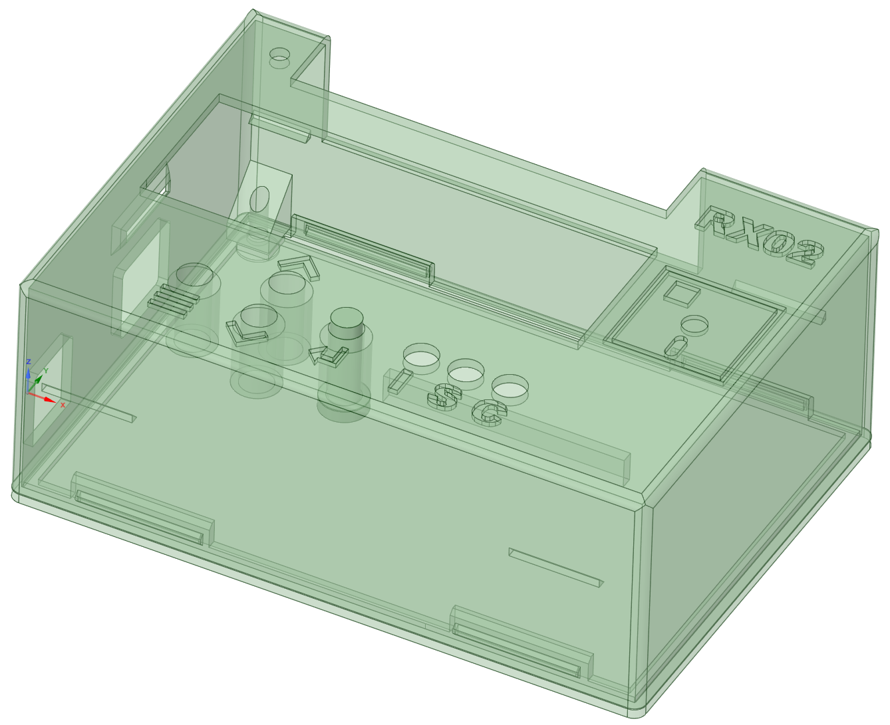

# rx02-emulator-mega-shield

Arduino Mega2560 shield with buttons and LCD based on [AK6DN's DEC RX02 emulator](https://github.com/AK6DN/rx02_emulator) board design and code.  There is a fork of his project at  https://github.com/djtersteegc/rx02_emulator that adds software support for the new board design.

You can also still run it via the original serial terminal command scheme.  If you don't want to build it with the LCD or buttons, you can disable supprort in the code by leaving

`#define USE_LCD_MENU`

commented out (undefined) in `my_project.h`

Resistor numbers is also different than AK6DN's original board so please refer to this mapping table below or the CSV file.

[Termination Resistor Table.csv](https://github.com/djtersteegc/rx02-emulator-mega-shield/blob/main/Termination%20Resistor%20Table.csv)

Most of the resistor footprints should NOT be populated.

| Signal         | Resistor | Value   | Resistor | Value   |
| -------------- | -------- | ------- | -------- | ------- |
| RX_DMA_MODE_H  | R2       | -       | R1       | **390** |
| RX_AC_L        | R4       | **120** | R3       | -       |
| RX_OUT_L       | R6       | -       | R5       | -       |
| RX_SHIFT_L     | R8       | -       | R7       | -       |
| RX_12BIT_L     | R10      | **180** | R9       | **390** |
| RX_DATA_L      | R12      | **180** | R11      | **390** |
| RX_DONE_L      | R14      | -       | R13      | -       |
| RX_XFER_RQST_L | R16      | -       | R15      | -       |
| RX_INIT_L      | R18      | -       | R17      | **390** |
| RX_ERROR_L     | R20      | -       | R19      | -       |
| RX_RUN_L       | R23      | **180** | R22      | **390** |

STL's and the [DesignSpark Mechanical](https://www.rs-online.com/designspark/mechanical-software) source file for an snap fit enclosure are in the **enclosure** directory. There is also a provision to secure it with one M3x6mm (or longer) screw if you want.  Since the power and USB port spacing on the Chinese clone Arduino Mega2560's with the CH340 serial chip is different than the original design there are two STL's for the case body, pick the one that matches your board.

All components can be sourced from the usual low cost China based vendors for a total build cost of around $20.  Please see the assembly page for more details.

[Hardware Component Choices and Assembly](https://djtersteegc.github.io/rx02-emulator-mega-shield/assembly.html)

An interactive BOM and parts placement diagram is also available.

[Interactive Bill of Materials (BOM)](https://djtersteegc.github.io/rx02-emulator-mega-shield/ibom.html)

# Getting a Board

You can download the Gerbers and use your favorite fab (JLCPCB, PCBWay, etc.) to make your own batch.  It's a standard two layer, 1oz copper board with dimensions of 99mm x 71mm so it squeaks under the 100mm x 100mm limit of the cheap Chinese fabs.

# Hardware Revisions

### Version 1.0

After designing and building the [Mega Pro SMD](https://github.com/djtersteegc/rx02-mega2560-pro) version of this, I discovered the reason you always had to do a ReINIT of the emulator to get it recognized was I failed to pick interrupt enabled pins on the Mega2560 for the RX_INIT and RX_RUN lines.  This has been corrected in the v1.1 board and you can fix this yourself in v1.0 by adding two jumper  wires from D22 to D2, and D26 to D3.  Once complete, reflash with the updated version of the code at https://github.com/djtersteegc/rx02_emulator 

### Version 1.1

Moved the RX_INIT and RX_RUN lines to interrupt enabled pins on the Mega2560.

