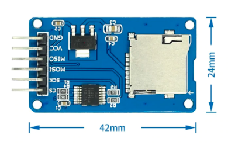

# Hardware Component Choices and Assembly

[Interactive Bill of Materials (BOM)](ibom.html)

### LCD and Mounting

Any old HD44780 1602 LCD from Aliexpress/eBay for ~$2.  You do not need the I2C module, LCD is connected in 4bit parallel mode. For the stand-off mounts you need [11mm M2.5 spacers](https://www.aliexpress.com/item/1005001478740318.html) and screws (same as used mount a Raspberry Pi hat)

 

and a 16 pin (16p) female header.  I buy the  [40 pin packs](https://www.aliexpress.com/item/32724478308.html) and cut them down.

### Micro SD Card Connector

This is the common push-push [Micro SD module](https://www.aliexpress.com/item/1873549637.html) with level shifters.  Sometimes it may say "Catalex" (maybe the original designer?) on the back of the PCB.  You will need to remove the pre-soldered right angle header they all seem to come with so you can mount it upside down on the ADE shield board.

### Arduino Pin Headers

The BOM shows stacking Arudino socket strip headers since that's what was in the Kicad Mega shield template, but since you are not going to stack anything on this shield, just use the standard [2.54mm male pin headers](https://www.aliexpress.com/item/32724478308.html) you see everywhere.  You can even use two 1x18 strips instead of a 2x18 for the end connector on the Mega.

 

